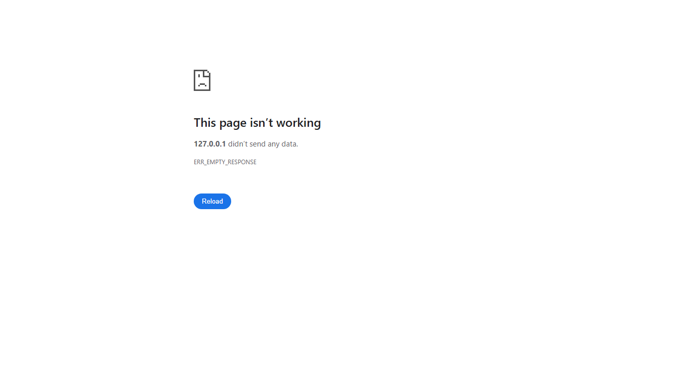
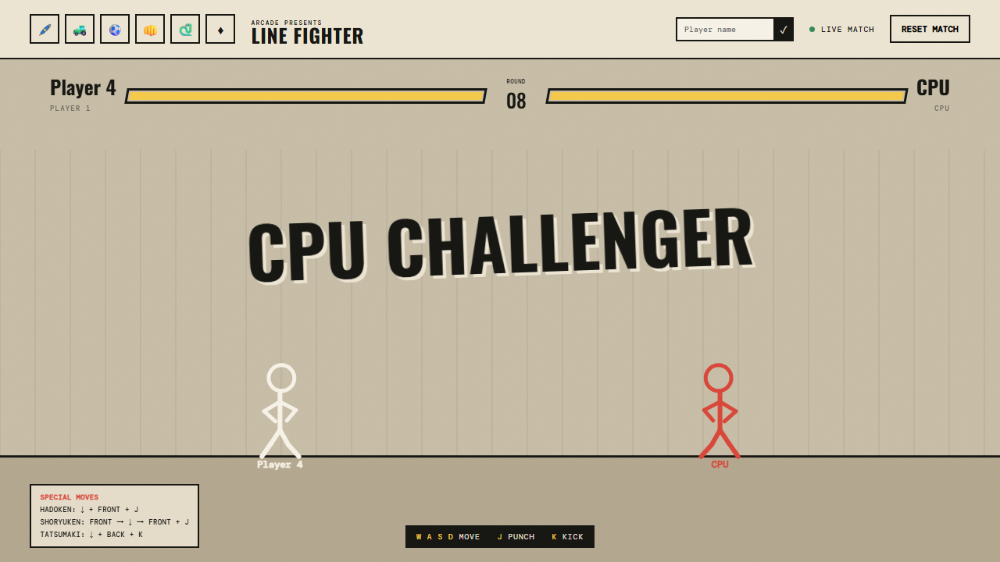
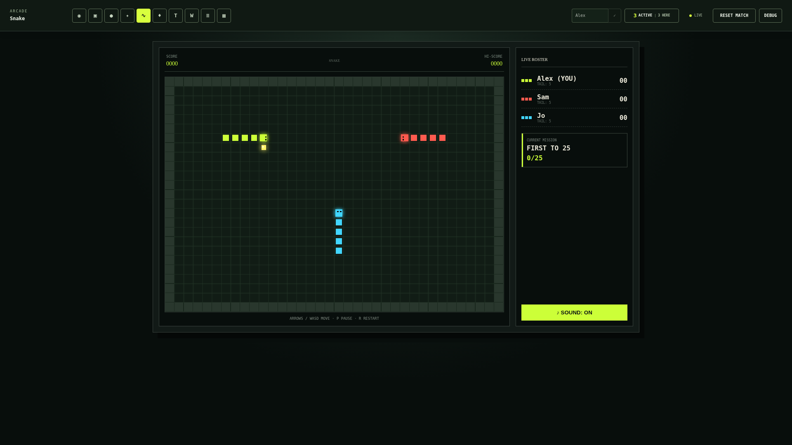
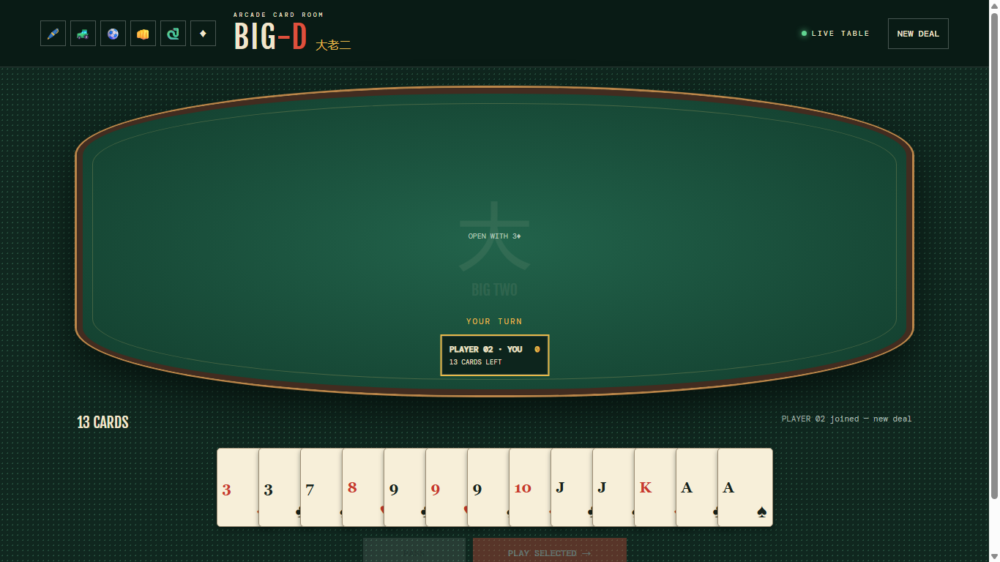

# Arcade

## Gameplay showcase

| Drawing Board | Tank | Penalty Shootout |
| --- | --- | --- |
|  |  |  |
| Collaborate on a shared live drawing canvas with chat. | Drive a first-person 3D tank arena with mouse-box controls. | Take alternating penalty kicks in a two-player shootout. |

| Line Fighter | Snake | Big-D |
| --- | --- | --- |
|  |  |  |
| Fight a CPU or another player with stick-figure special moves. | Share one real-time Snake grid with every connected player. | Play a shared Big Two card game for one to four players. |

A small real-time browser arcade with a collaborative drawing board, multiplayer tank arena, two-player penalty shootout, Line Fighter, and Snake. Game state and presence live only in the Node.js process and reset whenever it restarts.

## Run locally

Requires Node.js 18 or newer.

```bash
npm install
npm run dev
```

Open <http://localhost:3000> in multiple browser windows to try the real-time modes. Development mode watches the React client and Node server and reloads connected tabs automatically. Use `npm start` for a production build and server.

## How HTTPS and WebSockets work

HTTPS and WebSockets serve different purposes in this application:

- **HTTP/HTTPS** handles request-and-response traffic. The browser requests the HTML, CSS, JavaScript, and `/healthz`, and the server returns a response for each request.
- **WebSocket** creates one persistent, two-way connection after the page loads. The browser and server can then send game state, drawing strokes, chat messages, presence changes, and synchronized app switches immediately without polling or reloading the page.
- Local development uses `http://` plus `ws://`. Production uses encrypted `https://` plus `wss://`.

The browser selects the WebSocket protocol from the page protocol:

```js
const protocol = location.protocol === 'https:' ? 'wss' : 'ws';
const socket = new WebSocket(`${protocol}://${location.host}?room=tanks`);
```

In production, Caddy terminates HTTPS and forwards both ordinary HTTP requests and WebSocket upgrade requests to the Node container. Caddy handles the WebSocket upgrade automatically:

```text
Browser -- HTTPS/WSS --> Caddy -- HTTP/WS --> arcade:3000
```

`server.js` uses the native Node HTTP server for files and health checks and the `ws` package for WebSocket connections. The `room` query parameter routes a connection to the drawing board or a particular game. Authoritative multiplayer state stays in the Node process and is broadcast to connected clients. Each browser tab has its own session identity, so two tabs on the same computer are treated as two users. A disconnected player is retained for 10 seconds for reconnection; after that, returning creates a new player.

Because game state is currently held in memory, restarting the Node container resets the active boards and games. Run only one Arcade server instance unless a shared state and pub/sub service such as Redis is added.

### Local Docker development

The base Compose file is combined with the local override, which publishes port 3000, mounts the source tree, and runs the frontend/server watchers:

```bash
docker compose -f compose.yaml -f compose.local.yaml up --build
```

Stop it with:

```bash
docker compose -f compose.yaml -f compose.local.yaml down
```

## Deploy on Hostinger with Docker and Caddy

> This deployment requires a **Hostinger VPS** (or another plan with SSH and Docker access). Shared hosting cannot run this app because Arcade needs a persistent Node.js process and WebSocket connections.

The included multi-stage image builds the React application, removes development dependencies, runs as the unprivileged `node` user, and exposes a `/healthz` container health check.

1. Clone the repository on the VPS.
2. Confirm the external network used by Caddy exists. The default expected name is `caddy`:

   ```bash
   docker network inspect caddy
   ```

3. If your network has a different name, provide it when deploying:

   ```bash
   CADDY_NETWORK=your-caddy-network docker compose -f compose.yaml -f compose.prod.yaml up -d --build
   ```

   Otherwise run:

   ```bash
   docker compose -f compose.yaml -f compose.prod.yaml up -d --build
   ```

4. Add the following site to the Caddy container's configuration, replacing the hostname:

   ```caddyfile
   arcade.example.com {
       encode zstd gzip
       reverse_proxy arcade:3000
   }
   ```

5. Reload Caddy and verify the application:

   ```bash
   docker compose -f compose.yaml -f compose.prod.yaml ps
   docker compose -f compose.yaml -f compose.prod.yaml logs -f arcade
   ```

Caddy automatically proxies WebSocket upgrades. The Node port is exposed only to the shared Docker network and is not published on the VPS host.

Because state is in memory, run one Node.js instance for now. Multiple instances would need a shared pub/sub and state layer (such as Redis), which is a natural next step before scaling games horizontally.

### Continuous deployment from GitHub

The `Deploy production to Hostinger` GitHub Actions workflow targets the GitHub environment named `production`. It tests the app, builds the production Docker image, uploads an immutable source archive over SSH, and starts it with the production Compose configuration. It runs on pushes to `main` and can also be started manually from the Actions tab. Configure any required reviewers or deployment-branch restrictions under **Settings → Environments → production**.

Prepare the VPS once:

```bash
# Run as the SSH deployment user. Docker must already be installed.
docker network create caddy
sudo mkdir -p /opt/arcade/releases
sudo chown -R "$USER:$USER" /opt/arcade
```

Add these repository **Actions secrets** under **Settings → Secrets and variables → Actions**:

| Secret | Value |
| --- | --- |
| `HOSTINGER_HOST` | VPS hostname or IP address |
| `HOSTINGER_USER` | SSH user with permission to run Docker |
| `HOSTINGER_SSH_KEY` | Private key for that user (the full multi-line value) |
| `HOSTINGER_KNOWN_HOSTS` | Pinned host-key line from `ssh-keyscan -H your-vps-host` after verifying its fingerprint in Hostinger |
| `HOSTINGER_SSH_PORT` | SSH port; optional, defaults to `22` |
| `HOSTINGER_DEPLOY_PATH` | Release directory; optional, defaults to `/opt/arcade` |
| `CADDY_NETWORK` | External Docker network; optional, defaults to `caddy` |

Add the matching public key to `~/.ssh/authorized_keys` on the VPS. Keep the Caddy site configuration shown above in the Caddy deployment, and ensure both Caddy and Arcade use the same external network. Then push to `main`, or run **Deploy production to Hostinger** with `workflow_dispatch`.

Each deployment keeps the three most recent inactive releases under `HOSTINGER_DEPLOY_PATH/releases`, including the generated browser bundle at `public/react-app.js`, updates the `current` symlink only after the container health check succeeds, and prints the last container logs if startup fails. The workflow deliberately prevents concurrent production deployments.
