# Arcade

## Gameplay showcase

| Drawing Board | Tank | Penalty Shootout |
| --- | --- | --- |
| 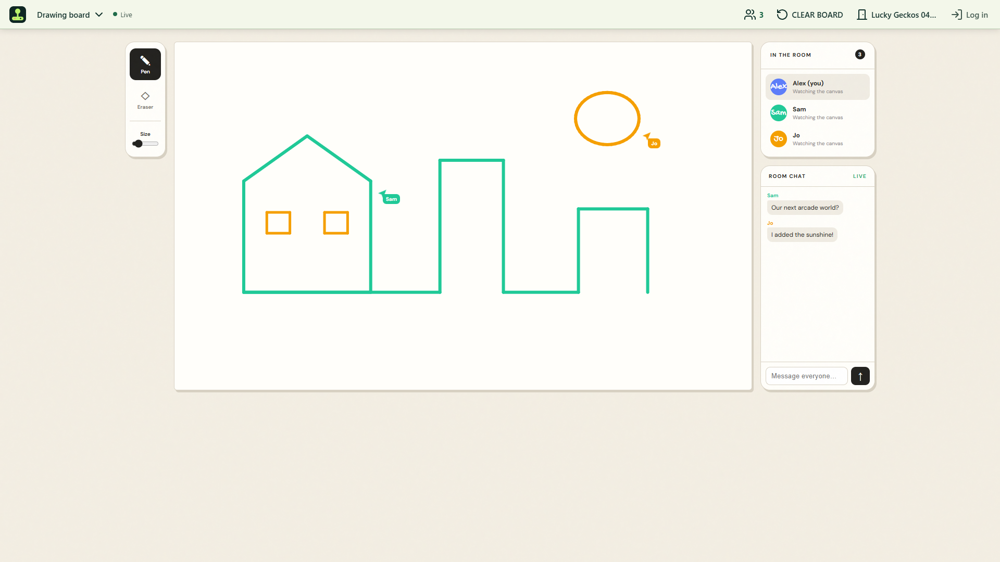 | 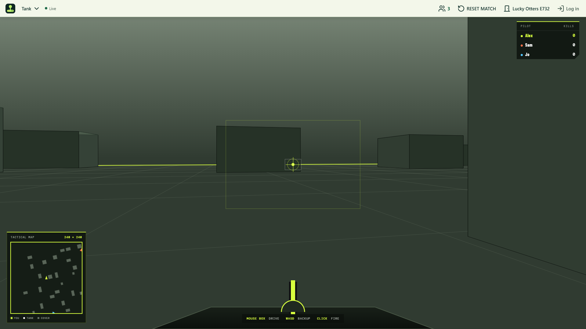 | 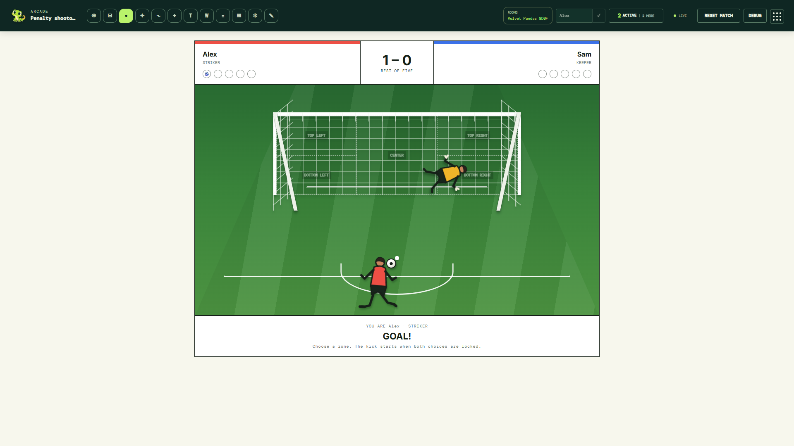 |
| Collaborate on a shared live drawing canvas with chat. | Drive a first-person 3D tank arena with mouse-box controls. | World Cup style penalty shootout on a FIFA-accurate pitch, with an O/X tracker (O goal, X save). |

| Line Fighter | Snake | Big-D |
| --- | --- | --- |
| 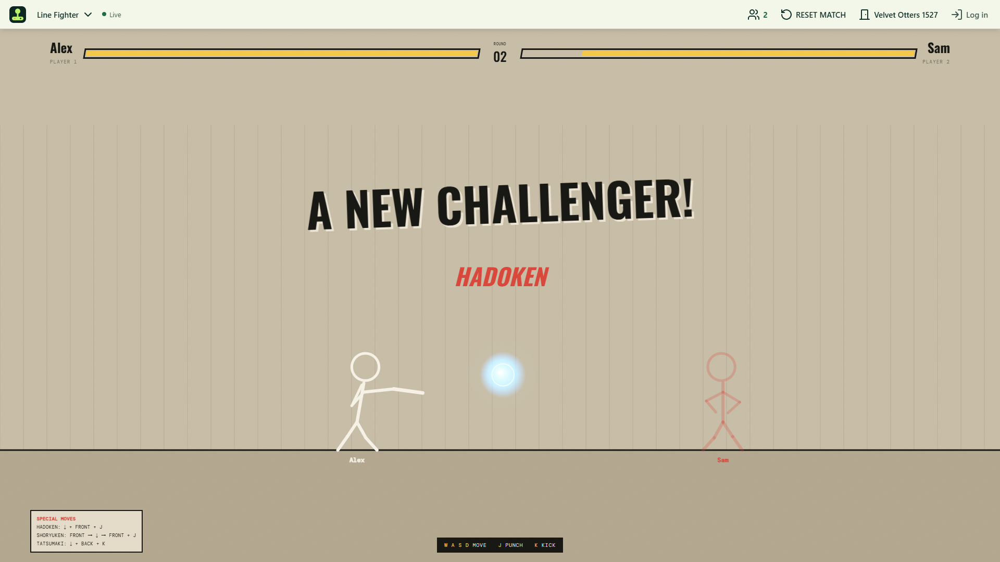 | 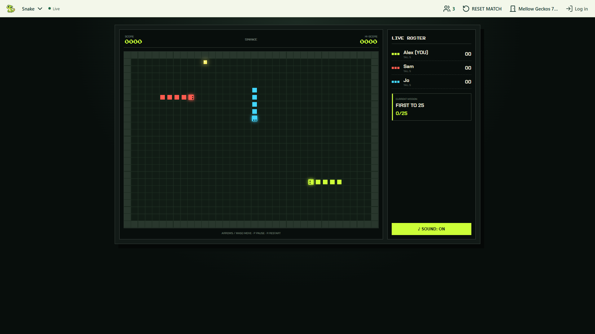 | 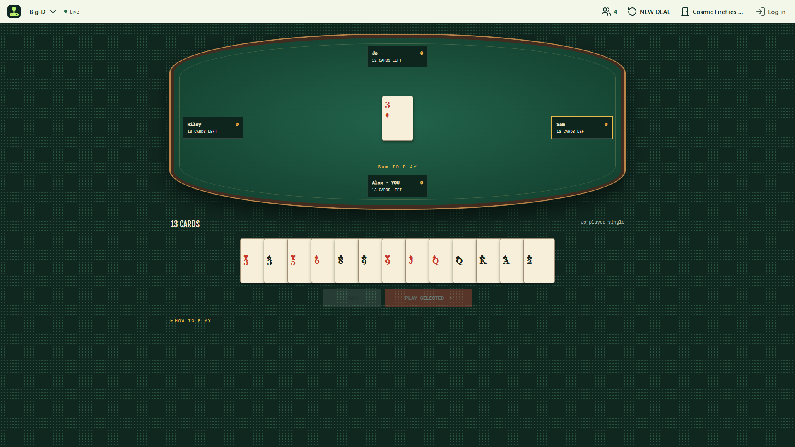 |
| Fight a CPU or another player with stick-figure special moves. | Share one real-time Snake grid with every connected player. | Play a shared Big Two card game for one to four players. |

| Type/Off | Many Words | Quick Poll |
| --- | --- | --- |
| 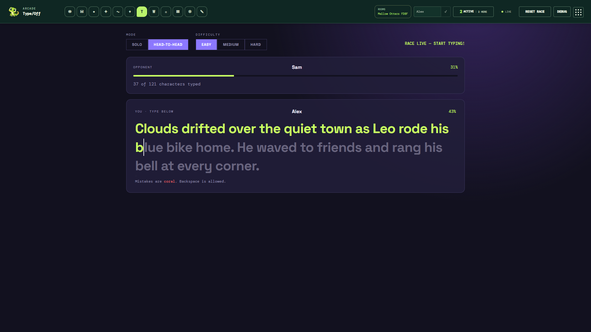 | 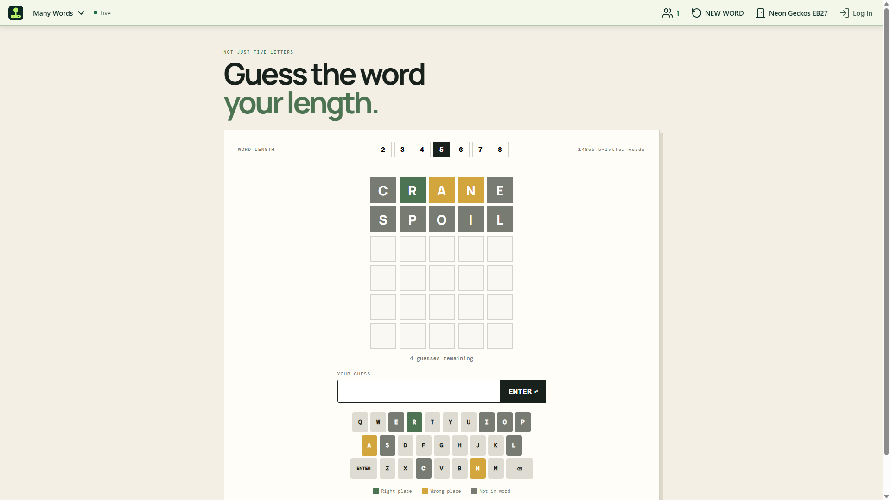 | 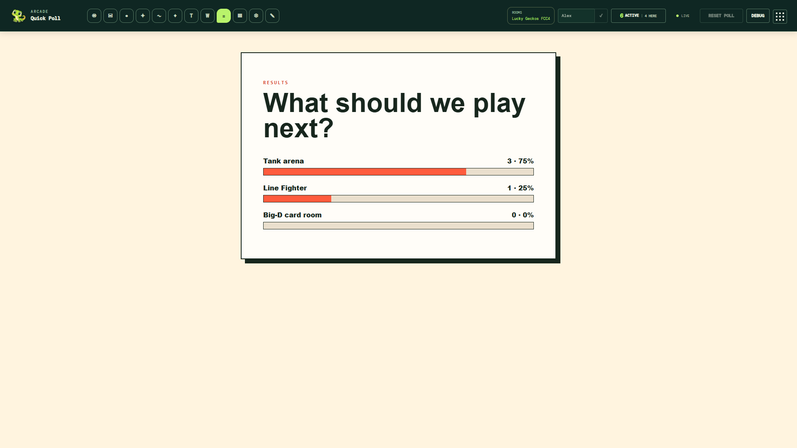 |
| Race head-to-head with karaoke-style feedback, three difficulties, and detailed results. | Play a private Wordle-style puzzle with two- through eight-letter words, including all 14,855 accepted five-letter Wordle guesses. | Create a live multiple-choice poll, share it by QR code, and reveal synchronized results. |

| Cube Lab | Slush Rush | Typo Hunt |
| --- | --- | --- |
| 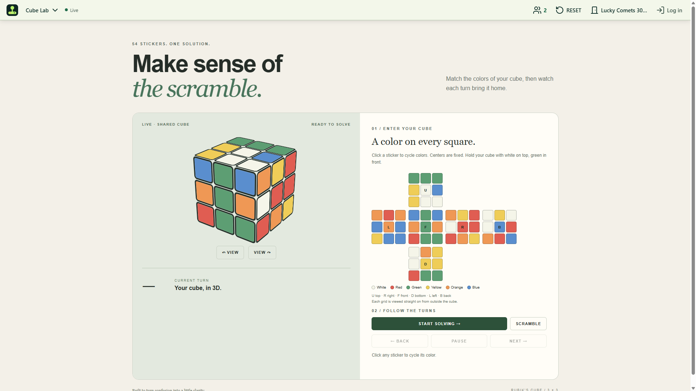 | 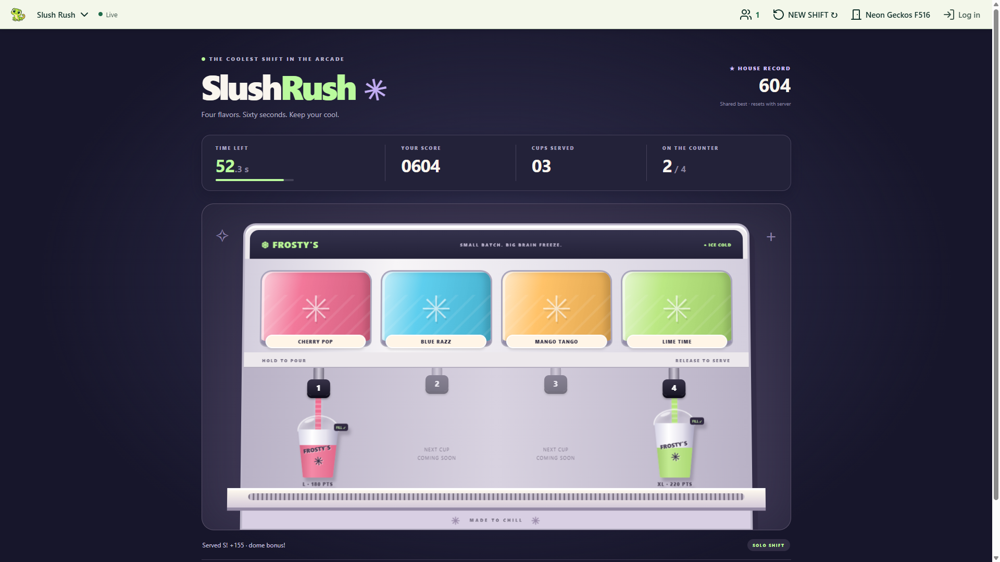 | 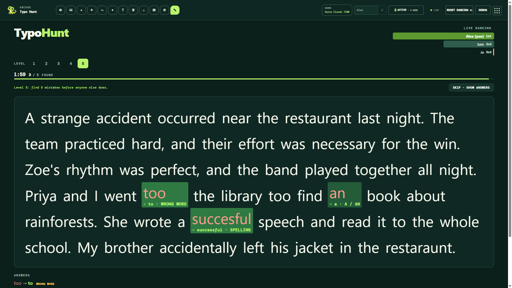 |
| Click stickers to enter your cube, then follow synchronized 3D turns with pause, back, and next controls. [Open Cube Lab](/cube). | Pour four fruity flavors into S–XL cups in a private 60-second shift. Fill the dome for a bonus, avoid spills, and chase the shared best score. [Play Slush Rush](/slushy). | A proofreading race: the whole room hunts the same spelling and grammar mistakes across five levels, with a live ranking. [Play Typo Hunt](/typohunt). |

| Twin Spot |
| --- |
| 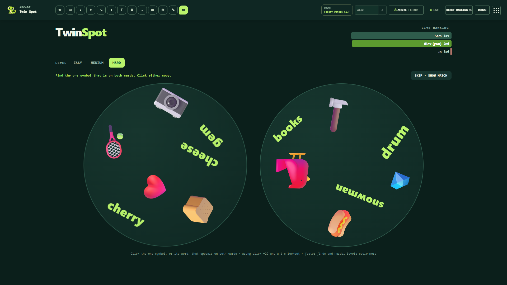 |
| A Spot-It style race: find the one emoji (or its word, on hard) that appears on both round cards, with a live ranking. [Play Twin Spot](/twinspot). |

<!-- screenshot-status:start -->
All thirteen previews are actual local app captures at 1920×1080, using synthetic test players. Every thumbnail is displayed at 320×180.
<!-- screenshot-status:end -->

A small real-time browser arcade with a collaborative drawing board, multiplayer tank arena, two-player penalty shootout, Line Fighter, Snake, Big-D, a typing challenge with solo and head-to-head modes, the solo variable-length Many Words game, live shareable Quick Polls, Cube Lab, the solo Slush Rush dispenser, the shared Typo Hunt proofreading game, the Twin Spot card-matching race, with an app switcher to the other Hedgies apps. Game state and presence live only in the Node.js process and reset whenever it restarts.

## Run locally

Requires Node.js 18 or newer.

```bash
npm install
npm run dev
```

Open <http://localhost:3000> in multiple browser windows to try the real-time modes. Development mode watches the React client and Node server and reloads connected tabs automatically. Use `npm start` for a production build and server.

### Visual assets

Run `npm run screenshots:check` to verify all thirteen showcase assets and their uniform dimensions. On a machine that permits a local Chrome/Chromium browser, `npm run screenshots` captures the actual app with synthetic test players and updates the showcase to thirteen PNGs. See [capture requirements and scene details](docs/screenshot-capture.md).

A cute lime-green gecko unifies the toolbar logo, browser favicon and installed app icons. The original artwork is `public/icons/gecko-source.png`; `public/icons/arcade.svg` defines its evergreen icon background. Run `python3 scripts/generate-icons.py` (needs Inkscape) to regenerate them; see [icon source and output details](public/icons/README.md).

## How HTTPS and WebSockets work

HTTPS and WebSockets serve different purposes in this application:

- **HTTP/HTTPS** handles request-and-response traffic. The browser requests the HTML, CSS, JavaScript, and `/healthz`, and the server returns a response for each request.
- **WebSocket** creates one persistent, two-way connection after the page loads. The browser and server can then send game state, drawing strokes, chat messages, presence changes, and synchronized app switches immediately without polling or reloading the page.
- Local development uses `http://` plus `ws://`. Production uses encrypted `https://` plus `wss://`.

The browser selects the WebSocket protocol from the page protocol:

```js
const protocol = location.protocol === 'https:' ? 'wss' : 'ws';
const socket = new WebSocket(`${protocol}://${location.host}?room=tanks`);
```

In production, Caddy terminates HTTPS and forwards both ordinary HTTP requests and WebSocket upgrade requests to the Node container. Caddy handles the WebSocket upgrade automatically:

```text
Browser -- HTTPS/WSS --> Caddy -- HTTP/WS --> arcade:3000
```

`server.js` uses the native Node HTTP server for files and health checks and the `ws` package for WebSocket connections. The `room` query parameter routes a connection to the drawing board or a particular game. Authoritative multiplayer state stays in the Node process and is broadcast to connected clients. Each browser tab has its own session identity, so two tabs on the same computer are treated as two users. A disconnected player is retained for 10 seconds for reconnection; after that, returning creates a new player.

Because game state is currently held in memory, restarting the Node container resets the active boards and games. Each named arcade room has independent game state. Run only one Arcade server instance unless a shared state and pub/sub service such as Redis is added.

### Run with Docker Compose

The default Compose configuration builds the development image, publishes the app only on localhost, mounts the source tree, and runs the frontend/server watchers:

```bash
docker compose up --build
```

Open <http://localhost:3000>. Compose automatically combines `compose.yaml` with `compose.override.yaml`, so edits made on the host are rebuilt or reloaded without rebuilding the image. The named volume keeps the container's Linux dependencies separate from host dependencies.

Stop it with:

```bash
docker compose down
```

## Deploy on the shared platform (Hostinger VPS)

> This deployment requires a **Hostinger VPS** (or another host with SSH and Docker access). Shared hosting cannot run this app because Arcade needs a persistent Node.js process and WebSocket connections.

Arcade runs as one container (`arcade`, port 3000) on the platform's external Docker network `platform-edge`. The platform's single Caddy proxy routes `arcade.<domain>` to `arcade:3000` (WebSockets pass through automatically), and the optional login and the app list come from the platform (`auth.<domain>`, `apps.<domain>`). The route file lives in the **infrastructure repository**, not here; [`deploy/arcade.caddy.example`](deploy/arcade.caddy.example) is the file to copy. The full first-production cutover, with rollback, is in [docs/shared-infra.md](docs/shared-infra.md).

The multi-stage image builds the React application, removes development dependencies, runs as the unprivileged `node` user, and has a `/healthz` health check. `compose.prod.yaml` adds `container_name: arcade`, the network alias `arcade`, `restart: unless-stopped`, the health check and the optional `APPS_URL` setting; nothing is published on the host. `compose.yaml` and `compose.override.yaml` stay the local-development setup.

Because state is in memory, run one Node.js instance for now. Multiple instances would need a shared pub/sub and state layer (such as Redis), which is a natural next step before scaling games horizontally.

To start it by hand on the VPS (the platform network must already exist):

```bash
docker network inspect platform-edge
docker compose --project-name arcade-shared -f compose.yaml -f compose.prod.yaml up -d --build
docker compose --project-name arcade-shared -f compose.yaml -f compose.prod.yaml ps
```

### Continuous deployment from GitHub

The `Deploy production to Hostinger` GitHub Actions workflow targets the GitHub environment named `production`. On every push to `main` (or a manual run) it tests the app, builds the browser bundle, validates the production image and the production Compose file, uploads an immutable source archive over SSH, and `deploy/hostinger-deploy.sh` builds and starts the container **on the server** (no container registry is involved). The script first checks that the `platform-edge` network exists, then runs `docker compose config --quiet` and `up -d --build --remove-orphans` as the Compose project `arcade-shared`, and waits for the health check.

Prepare the VPS once:

```bash
# Run as the SSH deployment user. Docker must already be installed and the platform infrastructure running.
sudo mkdir -p /opt/arcade/releases
sudo chown -R "$USER:$USER" /opt/arcade
```

Add these repository **Actions secrets** under **Settings → Secrets and variables → Actions**:

| Secret | Value |
| --- | --- |
| `HOSTINGER_HOST` | VPS hostname or IP address |
| `HOSTINGER_USER` | SSH user with permission to run Docker |
| `HOSTINGER_SSH_KEY` | Private key for that user (the full multi-line value) |
| `HOSTINGER_KNOWN_HOSTS` | Pinned host-key line from `ssh-keyscan -H your-vps-host` after verifying its fingerprint in Hostinger |
| `HOSTINGER_SSH_PORT` | SSH port; optional, defaults to `22` |
| `HOSTINGER_DEPLOY_PATH` | Release directory; optional, defaults to `/opt/arcade` |

The former `CADDY_NETWORK` secret is no longer used and can be deleted. An optional settings file `${HOSTINGER_DEPLOY_PATH}/.env` (for example `APPS_URL=...`) is read by Compose when it exists and is never created, changed or deleted by a deploy.

Each deployment keeps the three most recent inactive releases under `HOSTINGER_DEPLOY_PATH/releases`, including the generated browser bundle at `public/react-app.js`. After the container health check succeeds, `HOSTINGER_DEPLOY_PATH/current` points to the active release's `public` directory.

## Cube Lab

Open `/cube`. Click the six face grids to cycle white, red, green, yellow, orange, and blue. Centers remain fixed; view each face from outside with white on top and green in front. Start computes a two-phase solution on a server worker, validates color counts and physical solvability, and animates each turn. Pause, Next, Back, Scramble, and Reset synchronize for everyone in the cube room. View rotation is local. State is held in memory. The browser uses dependency-free CSS 3D; `cubejs` is used only on the server.

## Slush Rush

Open `/slushy` for a private 60-second slushy shift. Hold keys **1–4** or the matching dispenser levers with mouse/touch; release at the rim to serve automatically. S, M, L and XL cups have different fill times and point values. Clear domed lids hold another 24%: extra slush earns bonus points, but exceeding the dome spills the cup and triggers a cloth cleanup. The clock pauses during cleaning. Serve 3, 7 and 12 cups to unlock two, three and four simultaneous cups. Reset starts only your shift. Only the best score is shared, calculated by the server, and retained until the Node process restarts. Disconnected shifts pause and can reconnect within the normal 10-second grace period.

## Penalty shootout

Open `/penalty`. Two players take alternating penalties: the taker picks a corner of the goal, the keeper picks a side to dive, and both choices are locked in before the kick is taken. A kick is a goal unless the keeper dived to the zone it was aimed at. Each side takes five kicks (the shoot-out ends early once one side can no longer be caught), and a tie goes to sudden death.

- **Real pitch.** The scene is drawn from true measurements in metres and projected through a camera behind the penalty mark, so the lines converge like a broadcast: goal 7.32 m wide and 2.44 m high, goal area 5.5 m from each post and 5.5 m deep, penalty area 16.5 m from each post and 16.5 m deep, penalty mark 11 m out on the line through the middle of the goal (22 cm across), and the penalty arc (the crescent) with a 9.15 m radius from the mark, drawn only outside the penalty area. Lines are 12 cm wide, the ball is 22 cm across, the keeper stands on the goal line, and the net has a sloping back. `test/penalty-scene.test.js` checks these numbers.
- **Shoot-out tracker.** A World Cup style scorebug lists both sides with one circle per kick: **O** for a goal and **X** for a save, with a pulsing circle for the kick about to be taken. After five kicks each, sudden death adds one circle at a time. A GOAL! or SAVED! banner appears when the ball arrives.
- **Controls.** Click a zone of the goal, or tab to it and press Enter or Space (each zone is a labelled button). The server still decides the result of every kick and the score.

## Typo Hunt

Open `/typohunt`. Everyone in the same arcade room races on the same passage: only the wrong version is shown (no original to compare), and the first player to click a mistake scores it. Mistakes are common spelling and grammar slips: misspellings such as *definately* or *recieve*, mixed-up words (*there/their*, *loose/lose*, *its/it's*), *could of*, *a/an*, and subject-verb agreement.

- **Five levels.** Level *n* hides *n* mistakes. Level 1 is one short sentence (45 s); level 5 is a six-sentence paragraph with five mistakes (2 min). Any player can pick the level, which restarts the round for the whole room.
- **1,500 questions, built without an LLM.** `lib/typohunt-bank.json` holds a fixed bank per level: **500** at level 1, **400** at level 2, **300** at level 3, **200** at level 4 and **100** at level 5. Questions are dealt in a shuffled order, so none repeats until a level's whole bank has been seen. They are produced by plain rules in `lib/typohunt.js`: clean sentences (about 500 short ones for level 1, expanded from slotted templates such as "It's too {adj} to {verb}"; and for levels 2 to 5, 30 short stories whose sentences are in time order and stay in one tense) get a few words swapped for a known wrong form from a table of about 180 patterns, each with its own explanation. They cover the errors English learners make most: spelling (including dropped double consonants), homophones, missing apostrophes, subject-verb agreement (*she like*, *the news are*), verb forms (*buyed*, *has ate*, *is play*), prepositions (*in Monday*, *good in math*, *since three years*), plurals and counting (*childrens*, *advices*, *much people*), *a/an*, pronoun case (*me went*), and word choice (*said me*, *do a cake*). Each swap is guarded so that it is certain to be wrong in place, and the bank builder prefers the least-used patterns so questions do not keep repeating the same few mistakes. A level 2 to 5 passage is always a run of 2, 3, 4 or 6 consecutive sentences from a single story with one protagonist name, and every sentence names its own subject (no stray "she" or "they" pointing back to a sentence that is not there), so the passage reads as one sensible piece of writing wherever the run starts. Regenerate the bank (it is seeded, so the output only changes when the tables or sentences change) with `node scripts/generate-typohunt-bank.js`. `test/typohunt.test.js` checks every question.
- **Compete live.** A correct find scores 100 plus 25 per level above the first plus a time bonus; a wrong click deducts 25 points and locks that player out for 1.5 seconds. A wrong click is not highlighted in the passage, and found words show the fix and the kind of mistake. The live ranking is a sorted bar chart of everyone in the room (your own bar is highlighted; hover a bar for the exact score, and ties share a rank).
- **Celebration.** If every mistake is found and you found at least one of them without a single wrong click that round, your screen gets confetti and a PERFECT! banner (banner only when reduced motion is on). The server tracks each player's finds and wrong clicks per round for this.
- **Skip and answers.** *Skip · show answers* gives up on the passage for the whole room: no points are awarded, every missed mistake is revealed, and each answer (found or missed) lists the wrong word, the fix, the kind of mistake and a short reason (for example "a contraction needs an apostrophe where letters are missing"). The wrong word is shown in red and the fix in green, with no strikethrough.
- **Next question is a click.** Rounds never start on their own. When all mistakes are found, time runs out or someone skips, the answers stay on screen until an active player presses *Next question*, which keeps everyone's scores. *Reset ranking* (or changing level) zeroes the scores for the room. Up to 20 players compete; anyone beyond that watches and cannot act. A player who disconnects keeps their score during the reconnect grace period.
- **Server-authoritative.** The server alone knows which words are wrong; scores, penalties, finds and the clock never come from the browser, and the passage is withheld until the countdown ends.

## Twin Spot

Open `/twinspot`. Two round cards sit side by side and share exactly one symbol. Everyone in the same arcade room races to click it (on either card): a correct click scores, a wrong click deducts 25 points and locks that player out for one second. A live bar-chart ranking shows the room.

- **Difficulty.** *Easy*: five emoji on each card. *Medium*: seven. *Hard*: seven symbols, but three on each card are shown as their word instead of the emoji, so the match can be an emoji on one card and its word on the other (or two words). Emoji come in different sizes and are rotated to a random angle; no country flags are used.
- **Layout.** Every symbol is modelled as a capsule (a circle for an emoji, a long thin capsule for a rotated word) and placed where it has the most clear space, so items are spread across the card and never touch, even long words such as *elephant* or *scissors* turned at odd angles. Long words also get a smaller font. Emoji are sized by how wide they are actually drawn (about 1.2 times their font size), and as a safety net the page measures every symbol after it is drawn and shrinks any that would come within a few percent of the circle's edge, whatever emoji font the device uses.
- **Dealing.** After a match only the clicked card is replaced. The card that stays on the table keeps its layout, and the new card shares exactly one symbol with it (never the symbol just found). Skipping a pair reveals the match and replaces one card at random. Changing the level or resetting the ranking deals two new cards and zeroes the scores.
- **Scoring.** 100 / 150 / 200 points by difficulty plus up to 50 for speed. Up to 20 players compete; anyone beyond that watches and cannot act.
- **Server-authoritative.** The server builds the cards, places every symbol so nothing overlaps, and alone decides whether a click is the match; the card data it sends carries no symbol ids.

## Toolbar

Every page shares one calm, fully fluid toolbar (`public/platform.js` and `public/platform.css`). On the left are the gecko logo (it links home) and the current game's name, which opens the list of all thirteen games. On the right are a few icon buttons:

| Button | What it does |
| --- | --- |
| People icon and number | The count of active players. Hover, focus or click reveals each player's name, IP address, room and connected time. |
| Reset | The game's reset control (it keeps its own label, such as "Reset match"). It never gives spectators control. |
| Door icon | Opens **Room and player**: your player name, the named rooms, **New room**, and the protocol log. |
| Nine dots | The other apps on the shared platform. Hidden when the platform's app list cannot be read. |
| **Log in** / your first name | The optional shared login (below). |

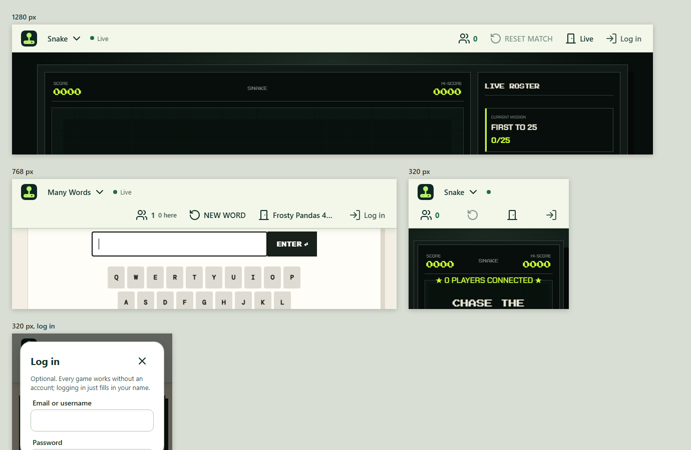

Layout rules: sizes are in `rem`, nothing in the bar has a fixed text width, long titles truncate with an ellipsis and a tooltip, and the right-hand group wraps below the title on phones from 320 px wide. Labels collapse into icon-only buttons under 40 rem, every button keeps its `aria-label` and tooltip, touch targets are at least 44 px, keyboard focus is always visible, menus open with Enter or Space, move with the arrow keys and close with Escape (focus returns to the button), colours follow `prefers-color-scheme`, and transitions are off under `prefers-reduced-motion`. The icons are inline SVG line icons on a 24 px grid with a 2 px `currentColor` stroke; there is no icon font and no emoji in the interface.

## Optional login

Nobody has to log in: every game works anonymously, exactly as before, and a slow or unreachable login service never delays a game. On load the page asks the platform's auth service (`https://auth.hedgies.cloud/me`, with the shared `sso_access` cookie) who you are. If you are signed in, your name appears in the toolbar and fills the player-name field in every game; you can still type another name, and a name you type wins for the rest of the session. If you are not, a small **Log in** button opens a dialog with email-or-username and password, **Continue with Google**, **Continue with Microsoft** and **Forgot password**. There is no sign-up form: new accounts are enabled by an administrator, and the dialog shows the server's message (for example "waiting for an administrator to enable it"). An OAuth return with `?auth_error=...` is shown in the dialog and removed from the address. **Log out** ends the session and clears a name that came from the account.

The client is `public/sso.js` (the same contract as the infrastructure repository's `clients/js/sso-auth.js`, including the single `/refresh` retry after a 401), loaded before `platform.js` on every page. The name is **display only**: the Arcade server does not verify the cookie, adds no authorization and stores nothing per user. The auth address can be changed for a test environment by setting `window.ARCADE_SSO_BASE` before `platform.js` loads.

## App switcher

The nine-dot button in the toolbar opens the other apps on the shared platform. The server (`GET /api/platform-apps`, `lib/apps.js`) reads the platform's registry from `APPS_URL` (default <https://apps.hedgies.cloud/app.json>; set it to an empty value to turn the switcher off), hides this app by its `id` (`arcade`), and takes each app's name and icon from that app's own page and web manifest (`<link rel=manifest>`, otherwise `manifest.webmanifest`; a small `apple-touch-icon` wins over a huge manifest image). Nothing about the other apps is hard coded. Every fetch is https-only, refuses private and loopback addresses (also after redirects and on the address actually connected to), reads at most 512 KB, and results are cached for ten minutes; when the registry cannot be read the last good list is served, and with none the list is empty, so the browser hides the button. Apps open in a new tab.

## Named arcade rooms

Use the door button in the shared toolbar (**Room and player**) to see each room's random name, current game and player count. Choose **New room** to start a separate room or select another room to join its game. Game switches, drawing, chat, matches and resets affect only your room. Your room selection is kept for this browser tab across game changes and reconnects. Empty rooms disappear from the directory immediately and are destroyed after a 10-second reconnect grace period, including all game state, timers and cube-solving workers. Rooms and game state reset when the server restarts. Slush Rush shifts remain private and its best score is shared across all rooms. Slushy dispensing is now twice as fast (a small cup reaches the rim in about 1.2 seconds).
